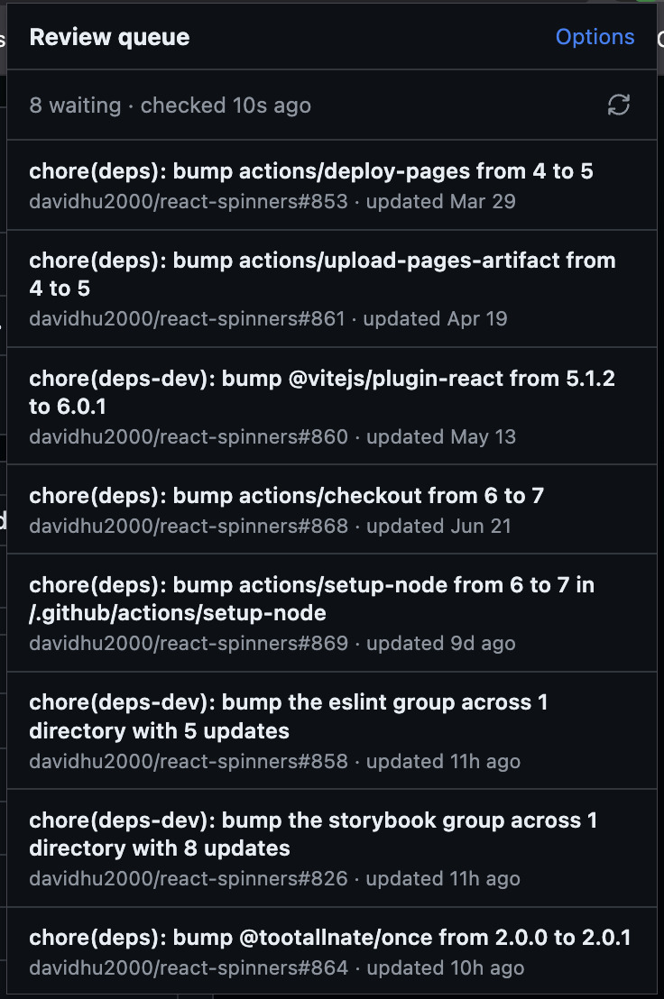

# Pull Request Review Queue

This solves a real issue I faced on a daily basis where I often have multiple pull requests waiting for my review. I started this project to have a way to quickly jump to the next pull request in my queue with minimal clicks.

## Features

A list of all pull requests where you are assigned as reviewer.

A `Next PR` button to quickly jump to the next pull request in your queue after reviewing the current one.

## What PRs are included?

- Queue = `is:pr is:open review-requested:@me draft:false` in selected repositories
- Order = `updated` ascending (proxy for longest waiting)

## Installation (unpacked)

1. Open `chrome://extensions`
2. Enable **Developer mode**
3. **Load unpacked** → this folder
4. Open **Options** → paste PAT + allowlist repos (`owner/name`, one per line)
